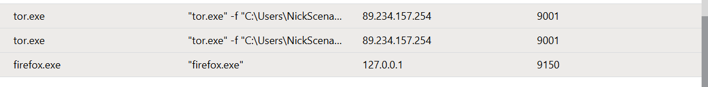

# Threat Hunt Report: Unauthorized TOR Usage
- [Scenario Creation](https://github.com/NBretzke/Threat-Hunting-Project-Unauthorized-TOR-Usage-/blob/main/ThreatHuntCreation.md)

---

## Platforms and Languages Leveraged
- Windows 10 Virtual Machines (Microsoft Azure)
- SIEM: Microsoft Sentinel
- EDR Platform: Microsoft Defender for Endpoint
- Kusto Query Language (KQL)
- Tor Browser

---

## Scenario

Management suspects that employees may be using TOR browsers to bypass network security controls after unusual encrypted traffic patterns and connections to known TOR entry nodes were observed. Anonymous reports also suggested employees were discussing methods to access restricted websites during work hours.

The goal of this threat hunt was to detect any unauthorized TOR usage, analyze correlated endpoint and network activity, and take appropriate response actions if confirmed.

---

## High-Level TOR-Related IoC Discovery Plan

- Identify TOR-related **file artifacts** on endpoints
- Detect **process execution** associated with TOR installation and usage
- Confirm **network connections** over known TOR ports
- Correlate all findings into a single investigative dataset

---

## Detection & Investigation Methodology

A single **correlated KQL query** was used to unify telemetry from:

- `DeviceFileEvents`
- `DeviceProcessEvents`
- `DeviceNetworkEvents`

This approach allowed TOR-related file activity, process execution, and network connections to be reviewed in one dataset (correlation-first investigation).

Once the analytics rule triggered, the incident was assigned and investigated using the correlated results.

---

## Correlated Hunt Query (Union)

> Update the `DeviceName`, time window, and any identifiers to match your environment.

```kql
union
(
    DeviceFileEvents
    | where FileName has_any ("tor", "onion", "firefox")
    | project Timestamp, DeviceName, ActionType, FileName, FolderPath, SHA256,
              Account = InitiatingProcessAccountName
),
(
    DeviceProcessEvents
    | where FileName has_any ("tor.exe", "firefox.exe", "tor-browser.exe")
        or ProcessCommandLine has_any ("tor-browser-windows", "Tor Browser")
    | project Timestamp, DeviceName, ActionType, FileName, FolderPath, SHA256,
              Account = AccountName, ProcessCommandLine
),
(
    DeviceNetworkEvents
    | where InitiatingProcessFileName has_any ("tor.exe", "firefox.exe")
    | where RemotePort in (9001, 9030, 9040, 9050, 9051, 9150, 80, 443)
    | project Timestamp, DeviceName, ActionType, RemoteIP, RemotePort, RemoteUrl,
              Account = InitiatingProcessAccountName,
              InitiatingProcessFileName, InitiatingProcessFolderPath
)
| order by Timestamp desc

```
Steps Taken

1. Correlated TOR Detection Rule Triggered
A Microsoft Sentinel analytics rule was created using a single correlated KQL query that unified telemetry from DeviceFileEvents, DeviceProcessEvents, and DeviceNetworkEvents. This allowed TOR-related file activity, process execution, and network connections to be analyzed within one dataset.
Once the rule triggered, the incident was assigned and marked active for investigation.

2. TOR Browser Installation Confirmed
Process execution events within the correlated dataset confirmed that the TOR Browser installer was executed in silent mode, indicating intentional installation. The installer was launched from the user’s Downloads directory using the /S flag, consistent with a background installation.
This confirmed that TOR was successfully installed on the endpoint threat-hunt-lab.
- 

4. TOR Browser Execution Observed
Subsequent process telemetry showed multiple executions of TOR-related processes, including firefox.exe (TOR) and tor.exe. These events confirmed that the TOR Browser was launched and actively used by the user.
Repeated process creation events suggested continued interaction and possible troubleshooting during initial TOR usage.
- 

6. TOR Network Activity Verified
Network telemetry within the same correlated dataset confirmed outbound connections over known TOR ports. A successful connection was established on port 9001, initiated by tor.exe, validating TOR network usage.
Additional TOR-related connections were observed over ports 443 and 9150, indicating ongoing TOR browser activity.
- 

8. TOR-Related File Artifacts Identified
Review of correlated file events revealed that multiple TOR-related files were copied to the user’s desktop following installation. Additionally, a file named tor-shopping-list.txt was created on the desktop, suggesting user interaction after TOR browser usage.
- 

10. Evidence Collection and Documentation
Relevant evidence, including correlated logs, process execution details, network connections, and screenshots, was collected and reviewed. A chronological timeline was reconstructed to document the sequence of events, and findings were summarized to support incident response actions.

## Summary

The user employee on the endpoint threat-hunt-lab initiated and completed the installation of the TOR Browser using a silent installation method. Correlated telemetry from device file, process, and network events confirmed the successful download, execution, and repeated use of TOR-related processes, including tor.exe and the TOR-modified firefox.exe. Network telemetry validated outbound connections over known TOR ports, confirming active participation in the TOR network.

Additionally, TOR-related file artifacts were identified on the user’s desktop following installation, including the creation of a file named tor-shopping-list.txt, indicating post-installation user interaction and activity within the TOR Browser. This sequence of events demonstrates intentional installation and active usage of TOR for anonymous browsing purposes.

## Response Taken

TOR usage was confirmed on the endpoint threat-hunt-lab associated with the user employee. The incident was reviewed and documented, including correlated process execution, file artifacts, and network activity. Evidence was preserved through log collection and screenshots, and a chronological timeline was reconstructed to support investigation findings.

Based on the confirmed activity, the incident was escalated for further review in accordance with security policy, and appropriate stakeholders were notified.
